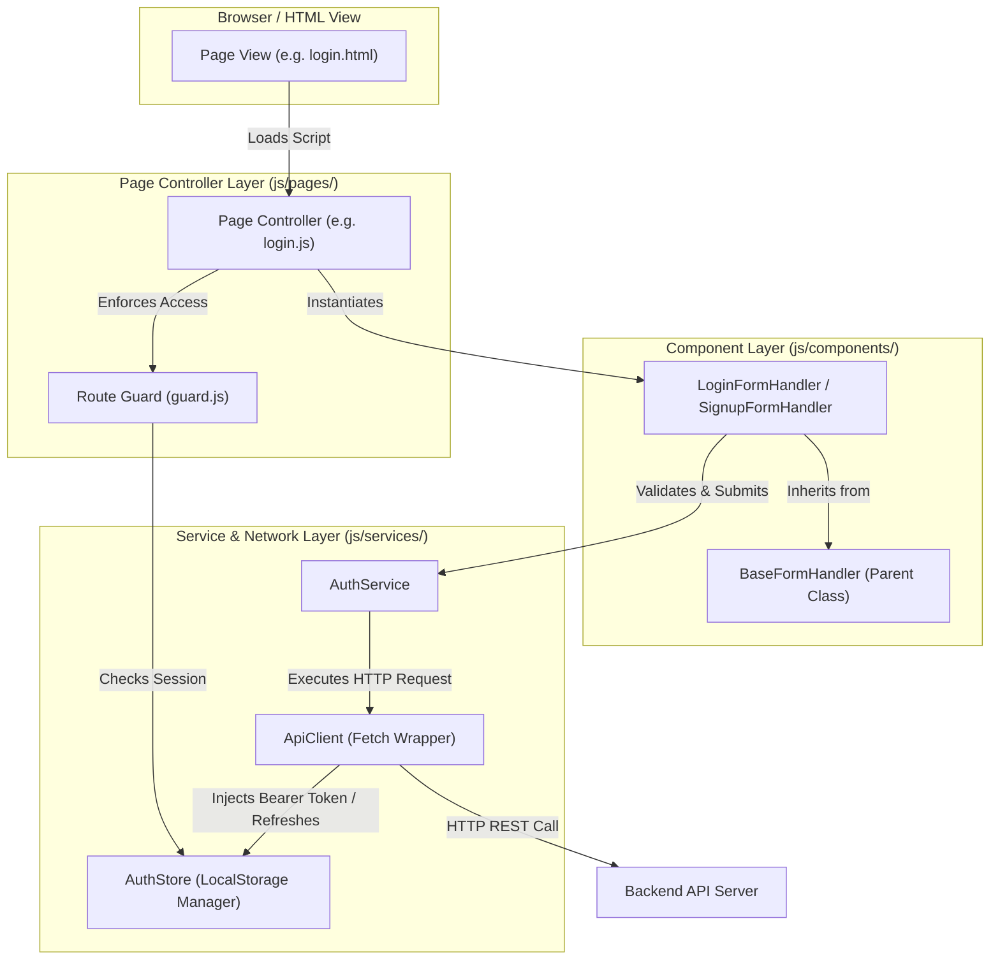
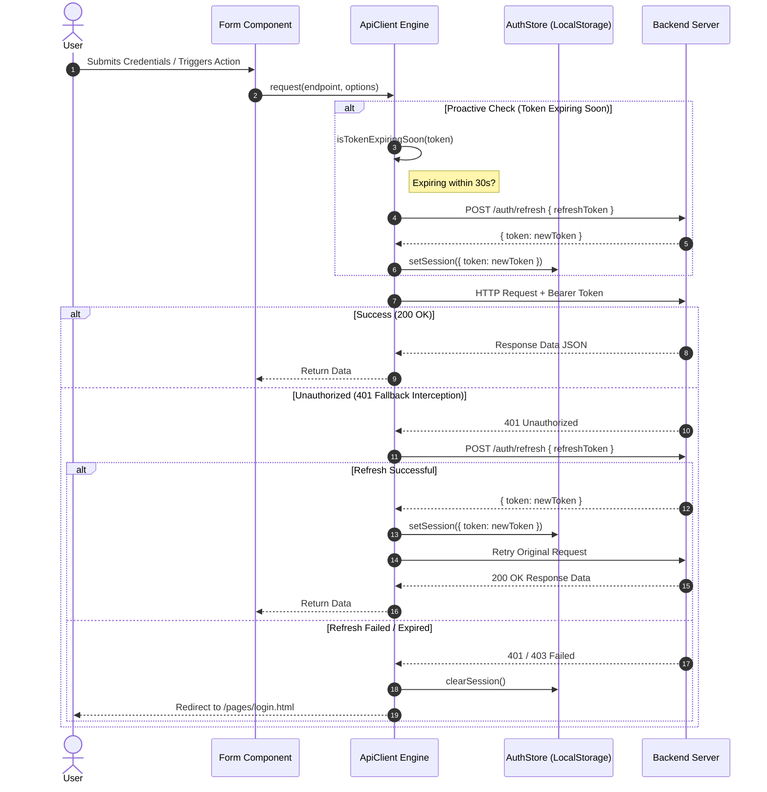

# 🚀 NARSS Dashboard - Developer Handbook & Architecture Guide

Welcome to the **NARSS Dashboard** developer documentation! This handbook is crafted specifically for developers and teammates contributing to the project. It covers system architecture, visual flow diagrams, design patterns, coding standards, step-by-step guides for adding new features/pages, and backend integration contracts.

---

## 📋 Table of Contents
1. [System Overview & Architecture](#-system-overview--architecture)
2. [Architecture & Data Flow Diagrams](#-architecture--data-flow-diagrams)
3. [Directory & File Breakdown](#-directory--file-breakdown)
4. [Teammate Onboarding & Setup](#-teammate-onboarding--setup)
5. [Developer How-To Guides](#-developer-how-to-guides)
   - [How to Add a New Page](#1-how-to-add-a-new-page)
   - [How to Add a New Form](#2-how-to-add-a-new-form)
   - [How to Add a New API Endpoint & Service Method](#3-how-to-add-a-new-api-endpoint--service-method)
6. [Design System & CSS Guidelines](#-design-system--css-guidelines)
7. [Security & Authentication Lifecycle](#-security--authentication-lifecycle)
8. [Developer Shortcuts & Testing Tools](#-developer-shortcuts--testing-tools)
9. [Code Conventions & Best Practices](#-code-conventions--best-practices)

---

## 🛰️ System Overview & Architecture

The **NARSS Dashboard** frontend is designed with pure **ES Modules**, **Bootstrap 5**, and custom **CSS tokens**. The project adheres to strict modular Object-Oriented Programming (OOP) principles:

- **No Framework Overhead**: Vanilla JS with native ES Modules (`import`/`export`), offering fast loading and zero build steps required for local development.
- **Separation of Concerns**:
  - `pages/` (HTML Views)
  - `js/pages/` (Page Controllers)
  - `js/components/` (UI & Form Component Handlers)
  - `js/services/` (Network API & Session Storage State)
  - `js/core/` (Constants, Route Guards, Validators)

---

## 📊 Architecture & Data Flow Diagrams

### 1. High-Level Component & Service Interaction



---

### 2. Authentication & JWT Auto-Refresh Flow



---

## 📁 Directory & File Breakdown

```
NARSS-Dashboard/
├── DOCUMENTATION.md           # Developer handbook & architecture guide
├── client/                     # Frontend codebase
│   ├── index.html              # Entrypoint router
│   ├── assets/                 # Branding assets (favicon.png, logos)
│   ├── css/                    # Stylesheets
│   │   ├── all.min.css         # FontAwesome 6 icons
│   │   ├── bootstrap.min.css   # Bootstrap 5 framework
│   │   └── main.css            # Custom tokens, button variants, form input styles
│   ├── js/
│   │   ├── components/         # Reusable Component Handlers
│   │   │   ├── base-form.js    # Base class for all form handlers
│   │   │   ├── login-form.js   # Login form logic & live validation
│   │   │   └── signup-form.js  # Signup form logic & password matching
│   │   ├── core/               # Core Infrastructure
│   │   │   ├── constants.js    # App configuration, endpoints, messages, selectors
│   │   │   ├── guard.js        # Route Guards (requireAuth, requireGuest)
│   │   │   ├── logout.js       # Logout handler function
│   │   │   └── validator.js    # Validation logic functions
│   │   ├── pages/              # Page Controllers
│   │   │   ├── index.js        # Root navigation router logic
│   │   │   ├── login.js        # Login page initialization script
│   │   │   ├── signup.js       # Signup page initialization script
│   │   │   └── dashboard.js    # Dashboard page initialization script
│   │   ├── services/           # Data Services & Network Layer
│   │   │   ├── api.js          # HTTP ApiClient with JWT decoding & auto-refresh
│   │   │   ├── auth.service.js # Auth API methods (login, signup, logout)
│   │   │   └── auth.store.js   # LocalStorage authentication persistence manager
│   │   └── temp/               # Development Utilities
│   │       └── devTool.js      # Testing hotkeys & loading overlay
│   └── pages/                  # HTML Views
│       ├── dashboard.html      # Protected Dashboard view
│       ├── login.html          # Login view
│       ├── signup.html         # Signup view
│       ├── forgot-password.html# Forgot password view
│       └── templates.html      # Reusable HTML template markup library
└── server/                     # Backend API project directory
```

---

## 🛠️ Teammate Onboarding & Setup

### Prerequisites
- Node.js (Optional, only for local static server) or VS Code.
- A modern Web Browser (Chrome, Firefox, Edge, Safari).

### Quickstart Guide
1. **Clone the Repository**:
   ```bash
   git clone <repository-url>
   cd NARSS-Dashboard
   ```

2. **Run a Local Web Server**:
   Since native ES Modules (`type="module"`) are used, files must be served via HTTP (`http://`), not file protocol (`file://`).

   - **Option A (VS Code)**: Install the **Live Server** extension, right-click `client/index.html` and click **Open with Live Server**.
   - **Option B (Node.js)**:
     ```bash
     npx serve client
     ```
   - **Option C (Python)**:
     ```bash
     cd client
     python -m http.server 8000
     ```

3. **Open Browser**:
   Navigate to `http://localhost:8000` (or your local server port).

---

## 👩‍💻 Developer How-To Guides

### 1. How to Add a New Page

When building a new view (e.g. `settings.html`):

#### Step A: Register the Route
Add the path to `ROUTES` in `client/js/core/constants.js`:
```javascript
export const ROUTES = {
  HOME: '/index.html',
  LOGIN: '/pages/login.html',
  SIGNUP: '/pages/signup.html',
  DASHBOARD: '/pages/dashboard.html',
  SETTINGS: '/pages/settings.html', // <-- Added new route
};
```

#### Step B: Create HTML View (`client/pages/settings.html`)
```html
<!doctype html>
<html lang="en">
  <head>
    <meta charset="UTF-8" />
    <meta name="viewport" content="width=device-width, initial-scale=1.0" />
    <link rel="icon" href="../assets/favicon.png" />
    <link rel="stylesheet" href="../css/bootstrap.min.css" />
    <link rel="stylesheet" href="../css/all.min.css" />
    <link rel="stylesheet" href="../css/main.css" />
    <title>Narss Settings</title>
  </head>
  <body>
    <main class="container py-5">
      <h1>User Settings</h1>
      <!-- Page Content -->
    </main>

    <!-- Page Script -->
    <script src="../js/pages/settings.js" type="module"></script>

    <!-- Dev Hotkey Tool (Include during development) -->
    <script src="../js/temp/devTool.js" type="module"></script>
  </body>
</html>
```

#### Step C: Create Page Controller (`client/js/pages/settings.js`)
```javascript
import { requireAuth } from '../core/guard.js';
import { authStore } from '../services/auth.store.js';

// Enforce auth protection (redirects to login if guest)
if (requireAuth()) {
  const currentUser = authStore.getUser();
  console.log('Loading settings for:', currentUser);
  
  // Page logic goes here...
}
```

---

### 2. How to Add a New Form

All forms should extend `BaseFormHandler` from `client/js/components/base-form.js` to get built-in error handling, loading button state, and input parsing.

#### Example: Creating `SettingsFormHandler`

1. Create `client/js/components/settings-form.js`:
```javascript
import { BaseFormHandler } from './base-form.js';

export class SettingsFormHandler extends BaseFormHandler {
  constructor(config) {
    super(config);
    this.initFields();
  }

  initFields() {
    const nameInput = this.form.querySelector('[name="fullName"]');
    if (nameInput) {
      nameInput.addEventListener('input', () => this.clearError('fullName'));
    }
  }

  async handleSubmit(event) {
    super.handleSubmit(event);
    const values = this.getValues();

    if (!values.fullName) {
      this.showError('fullName', 'Full name cannot be empty.');
      return;
    }

    if (typeof this.onSubmitCallback === 'function') {
      try {
        this.setLoadingState(true, 'Saving...');
        await this.onSubmitCallback(values);
      } catch (err) {
        this.showError('fullName', err.message || 'Failed to save settings.');
      } finally {
        this.setLoadingState(false);
      }
    }
  }
}
```

---

### 3. How to Add a New API Endpoint & Service Method

#### Step A: Register Endpoint in `constants.js`
```javascript
export const API_CONFIG = {
  BASE_URL: 'https://api.example.com/v1',
  ENDPOINTS: {
    LOGIN: '/auth/login',
    SIGNUP: '/auth/signup',
    LOGOUT: '/auth/logout',
    REFRESH: '/auth/refresh',
    UPDATE_PROFILE: '/user/profile', // <-- New Endpoint
  },
  TIMEOUT_MS: 10000,
};
```

#### Step B: Add Service Method in `user.service.js` or `auth.service.js`
Create or edit `client/js/services/user.service.js`:
```javascript
import { apiClient } from './api.js';
import { API_CONFIG } from '../core/constants.js';

export class UserService {
  async updateProfile(profileData) {
    return apiClient.put(API_CONFIG.ENDPOINTS.UPDATE_PROFILE, profileData);
  }

  async getProfile() {
    return apiClient.get(API_CONFIG.ENDPOINTS.UPDATE_PROFILE);
  }
}

export const userService = new UserService();
```

---

## 🎨 Design System & CSS Guidelines

The system uses Bootstrap 5 alongside a custom CSS utility layer defined in `client/css/main.css`.

### Custom Color Palette & CSS Tokens
- **Brand Primary Accent Color**: `#00a5d4` (Defined via `--bs-secondary-rgb: 0, 165, 212`)
- **Hover State**: `#00c6ff`
- **Error Messages**: `#df3545` (Class: `.error-message`)

### Standardized Form Input Structure
Use the `.input` wrapper for icons and input fields:
```html
<div class="mb-3">
  <label for="email" class="fw-medium">Email</label>
  <div class="input">
    <input type="email" id="email" name="email" class="form-control" placeholder="name@company.com" required />
    <span class="left">
      <i class="fa-solid fa-envelope"></i>
    </span>
  </div>
</div>
```

---

## 🔒 Security & Authentication Lifecycle

1. **Storage Mechanism**:
   - `auth_token`: JWT Access Token stored in `localStorage`.
   - `refresh_token`: Refresh Token stored in `localStorage`.
   - `auth_user`: User profile JSON object stored in `localStorage`.
2. **Proactive JWT Expiration**:
   - Before executing requests, `apiClient` parses the JWT token payload using native `atob`. If `payload.exp` is within 30 seconds, `apiClient` automatically triggers `refreshAccessToken()` before sending the original request.
3. **Session Cleardown**:
   - Calling `authStore.clearSession()` removes all auth keys from `localStorage` and resets application state.

---

## ⚡ Developer Shortcuts & Testing Tools

To speed up local development and testing, `client/js/temp/devTool.js` adds shortcut listeners:

| Keyboard Shortcut | Action | Description |
|---|---|---|
| `Ctrl + Shift + S` | **Quick Login Bypass** | Injects `token: "temp"` into `localStorage` and reloads into Dashboard. |
| `Ctrl + Shift + L` | **Quick Logout** | Wipes all tokens from `localStorage` and reloads back to Login. |

---

## 📏 Code Conventions & Best Practices

1. **No Magic Strings**: Always reference routes from `ROUTES`, selectors from `SELECTORS`, and messages from `MESSAGES` in `client/js/core/constants.js`.
2. **ES Module Imports**: Always include file extensions in import statements (e.g. `import { guard } from './guard.js';`).
3. **Pure Validators**: Keep validation functions pure in `client/js/core/validator.js` returning `{ isValid, message }`.
4. **Form Submissions**: Always handle async state with `this.setLoadingState(true)` and `finally { this.setLoadingState(false) }`.
5. **Git & Code Reviews**: Keep PRs modular, ensuring new pages include appropriate route guards (`requireAuth()` or `requireGuest()`).
